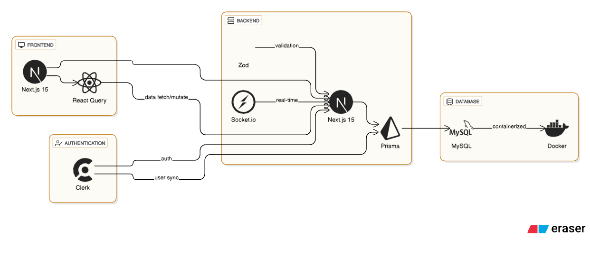

# ZOCIAL (Next.js 15 + Prisma + Clerk + React Query)

<!--  -->

This is a full-stack modern social media application built using the latest features from the Next.js 15 ecosystem, Prisma ORM, Clerk for authentication, and real-time updates using Socket.io.

---
## 🗄️ Database ER Diagram

---

## 🏛️ Architecture Diagram

---

